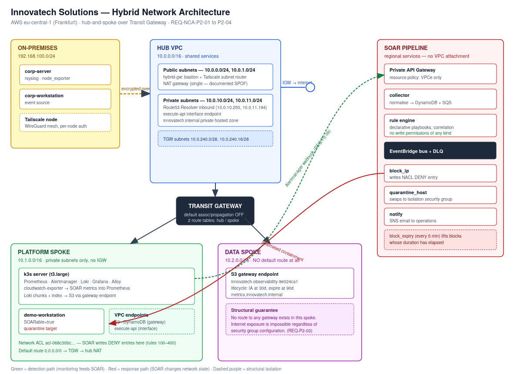

```{=openxml}
<w:p><w:r><w:br w:type="page"/></w:r></w:p>
```

# 1. Introduction

## 1.1 Purpose

This document describes the as-built architecture of the hybrid cloud platform delivered for Innovatech Solutions in period CS2-MA-NCA. It covers the network design, the observability stack, and the Security Orchestration, Automation and Response (SOAR) system, and it justifies the technology choices behind each.

It is written to be read alongside the operations manual (how to run the system) and the SOAR design and playbook document (how the response logic works in detail).

## 1.2 Business context

Innovatech Solutions has modernised its foundational IT infrastructure and connected its branch locations. Basic monitoring gives visibility into the on-premises environment, but the organisation now needs three things it does not have:

- **Automated response.** Security alerts are generated but handled manually. The time between an alert firing and a human acting on it is the window an attacker operates in.
- **Durable monitoring storage.** Monitoring data currently lives on the monitoring host. It is bounded by local disk and lost if that host is lost.
- **Cloud capability without exposure.** Management wants Platform-as-a-Service benefits for new workloads while keeping those services off the public internet and reachable from the existing on-premises estate.

The system described here addresses all three.

## 1.3 Scope

| In scope | Out of scope |
|---|---|
| Hub-and-spoke cloud network with segmented routing | Migration of existing production workloads |
| Private-only access to managed services | Multi-region disaster recovery |
| Observability stack with cloud-backed retention | Integration with a commercial SIEM |
| Event-driven SOAR with automated response actions | 24/7 staffed security operations |
| Infrastructure as Code for all cloud resources | On-premises hardware provisioning |

## 1.4 Requirements traceability

| Requirement | Where it is satisfied |
|---|---|
| P2-01 Design-for-failure | 3.5, 7 |
| P2-02 Network segmentation | 3.2, 3.3 |
| P2-03 Private cloud resource access | 3.4, 5.3 |
| P2-04 Internal cloud DNS resolution | 3.6 |
| P2-05 Observability stack research | 4.1 |
| P2-06 Event-driven SOAR architecture | 5.1, 5.2 |
| P2-07 Serverless SOAR components | 5.4 |
| P2-08 SOAR self-monitoring | 4.4 |
| P2-09 Observability as part of SOAR | 4.3 |
| P2-10 Infrastructure as Code | 6.1 |
| P2-11 CI/CD pipelines | 6.2 |
| P2-12 DevOps platform | 6.2 |

```{=openxml}
<w:p><w:r><w:br w:type="page"/></w:r></w:p>
```

# 2. Architecture overview

The platform is built on Amazon Web Services in the `eu-central-1` (Frankfurt) region, connected to the on-premises network by an encrypted overlay. It has four layers.

**Network.** A hub-and-spoke topology built on a Transit Gateway. One hub carries shared services and the only internet perimeter; two spokes carry workloads and data respectively.

**Platform.** A Kubernetes cluster (k3s) hosting the observability stack, plus a set of serverless functions hosting the SOAR pipeline.

**Data.** Object storage for long-term monitoring data, and a key-value store for SOAR operational state. No relational database. Section 8.2 explains why, and the reasoning is worth reading because the constraint changed the design for the better.

**Security response.** An event-driven pipeline that ingests alerts from every source, evaluates them against declarative playbooks, and executes containment actions without human intervention.

The design principle running through all four layers is **containment by construction**: wherever a security property can be guaranteed by the shape of the system rather than by a configuration setting, it is. A database with no route to the internet cannot be exposed by a misconfigured firewall rule. A rule engine with no write permissions cannot damage the environment however badly it misbehaves.

```{=openxml}
<w:p><w:r><w:br w:type="page"/></w:r></w:p>
```

# 3. Network design



## 3.1 Address plan

| Network | CIDR | Purpose |
|---|---|---|
| Hub VPC | 10.0.0.0/16 | Shared services, egress, hybrid entry point |
| Platform spoke | 10.1.0.0/16 | k3s cluster, workloads |
| Data spoke | 10.2.0.0/16 | Managed data services, interface endpoints |
| On-premises | 192.168.100.0/24 | Existing corporate network |

Ranges are non-overlapping so the on-premises network can be advertised into the cloud without translation, and so future spokes slot in at 10.3.0.0/16 and above without renumbering.

Each VPC uses two availability zones (`eu-central-1a`, `eu-central-1b`). Each has dedicated /28 subnets for Transit Gateway attachment interfaces, kept separate from workload subnets so the attachment does not consume usable addresses and so flow logs are easier to interpret.

## 3.2 Hub-and-spoke topology (REQ-NCA-P2-02)

The hub is the only VPC with an internet gateway. All spoke egress passes through it via a NAT gateway. Concentrating internet exposure in one place means there is exactly one perimeter to audit rather than three, and adding a fourth spoke later does not add a fourth perimeter.

A Transit Gateway connects the three VPCs. VPC peering was considered and rejected: peering is non-transitive, so *n* VPCs need *n(n-1)/2* connections and every new spoke requires touching every existing route table. The Transit Gateway makes that O(n), and it supports the segmented routing described next, which peering cannot express at all.

## 3.3 Controlled traffic flow

Default route table association and propagation are **disabled** on the Transit Gateway. Every attachment is bound to a route table explicitly, so reachability is something written down rather than something that emerges by accident.

Two route tables:

| Route table | Associated attachments | Reaches |
|---|---|---|
| `tgw-rt-hub` | Hub | All spokes (via propagation) |
| `tgw-rt-spoke` | Platform, Data | Hub only, plus explicit exceptions |

The spoke route table has a default route to the hub attachment and **no route between spokes**. Lateral movement from the platform spoke to the data spoke does not exist at the network layer unless it is explicitly created. Exactly one such exception exists, declared as a named resource:

```hcl
resource "aws_ec2_transit_gateway_route" "platform_to_data" {
 destination_cidr_block = var.data_cidr
 transit_gateway_attachment_id = module.data_spoke.attachment_id
 ...
}
```

An assessor or auditor can point at that resource and say "this is the only permitted east-west path, and here is the commit that introduced it."

## 3.4 Private access to managed services (REQ-NCA-P2-03)

The data spoke has **no default route at all**. It is not that outbound internet access is filtered; it is that no route to a gateway exists. This is the structural guarantee referred to in Section 2: a service placed in this spoke cannot reach or be reached from the internet regardless of how its security groups are later configured.

Managed services are reached through VPC endpoints:

| Service | Endpoint type | Placed in |
|---|---|---|
| S3 | Gateway | Platform spoke, Data spoke |
| DynamoDB | Gateway | Platform spoke |
| API Gateway (execute-api) | Interface | Hub, Platform spoke |

Gateway endpoints cost nothing and inject prefix-list routes directly into the route table, so traffic to S3 and DynamoDB leaves over the AWS backbone and never touches the NAT gateway.

The SOAR ingest API is a **private** REST API. It has no public DNS name, and its resource policy denies any request whose `aws:SourceVpce` is not one of our two endpoints. A leaked URL is useless from outside the network.

**Design note.** Two interface endpoints are used for `execute-api` rather than one. An interface endpoint's private DNS only resolves inside the VPC that hosts it, so a single hub endpoint would leave Alertmanager in the platform spoke resolving the ingest URL to a public address, following the default route out through NAT, and being rejected by the resource policy. The alternative. a customer-managed private hosted zone for `execute-api.eu-central-1.amazonaws.com` associated with every spoke and aliased to the hub endpoint. Scales better beyond three or four spokes and is the recommended production pattern. At this size the second endpoint is simpler to reason about and costs roughly €7 per month.

## 3.5 Design for failure (REQ-NCA-P2-01)

| Component | Failure behaviour |
|---|---|
| SOAR Lambda functions | Regional service, automatically multi-AZ. No single instance to lose. |
| SQS ingest queue | Regional, replicated. Absorbs bursts; events survive a rule engine outage. |
| DynamoDB | Regional, replicated across three AZs, point-in-time recovery enabled. |
| S3 | Eleven nines of durability, cross-AZ by default. |
| Transit Gateway | Managed, redundant across AZs. |
| NAT gateway | **Single point of failure, deliberate.** See below. |
| k3s server | **Single node, deliberate.** See below. |

Two components are knowingly not highly available, and the reasoning matters more than the fact:

**NAT gateway.** One gateway costs roughly €32/month; one per AZ costs roughly €64. The consequence of losing it is that spokes cannot reach the internet. Container image pulls and OS updates fail. It does **not** stop SOAR response actions, because those run in Lambda on the AWS network and never traverse the NAT. Degraded maintenance capability is an acceptable trade for the sandbox budget; production should set `single_nat_gateway = false`, which is a one-variable change.

**k3s server.** A single node hosts the observability stack. Losing it means losing dashboards and alert generation until it is rebuilt, which, because the node is defined entirely in code and bootstraps itself, takes about five minutes via `terraform taint` and `terraform apply`. It does not stop the SOAR pipeline, which has no dependency on the cluster. Production should run a three-node k3s cluster with an embedded etcd quorum.

This is the honest position: the system is designed so that the *security response* path has no single point of failure, and the *observability* path trades availability for cost in a way that is documented and reversible.

## 3.6 Internal DNS (REQ-NCA-P2-04)

A Route 53 private hosted zone, `innovatech.internal`, is associated with all three VPCs. Records in it resolve to private addresses only, and the zone has no public delegation.

A Route 53 Resolver inbound endpoint with interfaces in both hub private subnets allows the on-premises resolver to forward `*.innovatech.internal` queries into the cloud, so an on-premises host can reach a cloud service by name without a hosts file.

Current record:

| Name | Type | Target |
|---|---|---|
| `metrics.innovatech.internal` | CNAME | Observability S3 bucket regional endpoint |

The inbound endpoint is behind a feature flag (`enable_resolver_inbound`) because it costs roughly €0.25/hour for its two interfaces. VPC-internal name resolution continues to work when it is disabled; only the on-premises path is affected.

## 3.7 Hybrid connectivity

The on-premises network is joined by a Tailscale subnet router running on the hub gateway instance, which also serves as the SSH bastion.

An IPsec Site-to-Site VPN was considered first and rejected on a practical ground: the on-premises lab sits behind consumer NAT with no static public address, so there is no stable tunnel endpoint for AWS to connect to.

The security argument is stronger than the practical one, though. A traditional VPN joins two networks and trusts everything inside the resulting perimeter. A WireGuard mesh with per-node authentication means every machine authenticates individually to a coordination server and access control lists are applied per node. Compromising one machine does not expose the network behind it. That is the Zero Trust position: authenticate the workload, not the network segment.

**Trade-off worth naming.** The gateway instance is both bastion and subnet router. Copying an SSH private key onto it. As is currently required to reach the k3s node. Makes it a machine that holds credentials to everything behind it, which weakens exactly the property just described. The correct production arrangement is Tailscale SSH or AWS Systems Manager Session Manager for administrative access, with no long-lived key material on the bastion at all. Session Manager is already available: the k3s node carries the `AmazonSSMManagedInstanceCore` policy.

```{=openxml}
<w:p><w:r><w:br w:type="page"/></w:r></w:p>
```

# 4. Observability

## 4.1 Technology evaluation (REQ-NCA-P2-05)

Five stacks were evaluated against Innovatech's needs: metrics and logs in one place, cloud-backed retention, an alerting path that can drive automation, and operating cost proportionate to a mid-sized organisation.

| Stack | Strengths | Weaknesses | Verdict |
|---|---|---|---|
| **Prometheus + Grafana + Loki** | De facto standard for Kubernetes; pull model needs no agent configuration per target; Loki indexes labels rather than full text, so log storage is cheap; Alertmanager has a first-class webhook receiver | Prometheus local storage is not long-term; needs Thanos or object-store backends for history | **Selected** |
| Elastic Stack | Powerful full-text search; mature | Resource-hungry (JVM heap, dedicated master nodes); full-text indexing is expensive for logs that are mostly queried by label; licensing changes have created uncertainty | Rejected, cost |
| Fluent family + backend | Excellent, flexible collection | Collection only; still needs a storage and query layer, so it is a component rather than a stack | Rejected, incomplete |
| VictoriaMetrics + VictoriaLogs | Faster and more memory-efficient than Prometheus at scale; Prometheus-compatible | Smaller ecosystem; fewer engineers know it; scale advantage is irrelevant at this size | Rejected, team familiarity outweighs efficiency here |
| Graylog | Strong log management and alerting UI | Weak on metrics; would need a separate metrics stack alongside | Rejected, incomplete |

**Decision.** Prometheus + Grafana + Loki, with Alertmanager as the alerting path and S3 as the storage backend for Loki.

The deciding factor was not any single feature but the Alertmanager webhook receiver. It is what allows the monitoring system to become the primary event source for the SOAR pipeline rather than a parallel system that a human reads. Every other candidate would have required a bridging component.

## 4.2 Deployment

The stack runs on k3s in the platform spoke:

| Component | Role |
|---|---|
| Prometheus | Metrics collection, alert rule evaluation, 6h local retention |
| Alertmanager | Alert routing, webhook to the SOAR ingest API |
| Loki | Log aggregation, chunks and index in S3 |
| Grafana Alloy | Log collection from pods and host syslog |
| Grafana | Dashboards; data sources are Prometheus, Loki and CloudWatch |
| cloudwatch-exporter | Pulls SOAR and Lambda metrics into Prometheus |

k3s was used rather than EKS because the account's service control policy denies `eks:*`. k3s is a CNCF-conformant Kubernetes distribution, so the manifests and Helm charts are unchanged from what EKS would accept. The workload is portable even though the control plane is not managed.

## 4.3 Monitoring data storage

Loki writes log chunks and its TSDB index to S3, reached over the gateway VPC endpoint. Local disk holds only a short write-ahead buffer.

This is where the business requirement for "a more robust and scalable cloud-based database" for monitoring data is satisfied. Object storage is the standard production answer for observability retention: durability is eleven nines, capacity planning disappears, there is no instance to patch or fail over, and retention becomes a lifecycle rule rather than a disk-space problem.

The bucket lifecycle transitions objects to Infrequent Access after 30 days and expires them at 90, matching Innovatech's stated retention requirement.

## 4.4 SOAR observability (REQ-NCA-P2-08)

The SOAR system publishes its own operational metrics using the CloudWatch Embedded Metric Format. Structured log lines that CloudWatch converts into metrics, avoiding a synchronous API call on the request path.

| Metric | Dimensions | Meaning |
|---|---|---|
| `EventsIngested` | Source, Severity | Events accepted by the collector |
| `EventsRejected` | Reason | Malformed or unstorable events |
| `PlaybookMatched` | PlaybookId | Playbook evaluations that matched |
| `ActionsDispatched` | ActionType, PlaybookId | Actions published to the event bus |
| `ActionsExecuted` | ActionType | Actions that completed successfully |
| `ActionsFailed` | ActionType | Actions that raised |
| `ActionsSkipped` | ActionType, Reason | Actions refused by a safety guard |
| `EventsUnmatched` | EventType | Events no playbook handled |

`cloudwatch-exporter` scrapes these into Prometheus, so they appear on the same Grafana instance as infrastructure metrics.

Two of these deserve emphasis. `ActionsSkipped` with a reason label makes the safety guards **visible.** an operator can see that the system declined to block a private address rather than wondering why nothing happened. `EventsUnmatched` is a coverage metric: a rising unmatched rate means the playbook set has drifted behind the threats actually being seen.

Prometheus rules turn SOAR degradation into a SOAR event, so the system monitors itself:

- `SoarActionsFailing`, any action failure rate above zero for two minutes
- `SoarDeadLetterQueueNotEmpty`, messages parked in either dead-letter queue

```{=openxml}
<w:p><w:r><w:br w:type="page"/></w:r></w:p>
```

# 5. SOAR system design

## 5.1 Event-driven architecture (REQ-NCA-P2-06)


| Stage | Component | What happens |
|---|---|---|
| 1. Ingest | Private API Gateway, collector | Alerts arrive from Alertmanager, on-premises rsyslog and CloudWatch. The collector translates each format into one internal event schema. |
| 2. Store | DynamoDB, SQS | The event is written to the store before it is queued, so a later failure cannot lose it. |
| 3. Decide | Rule engine | Declarative playbooks are evaluated. Threshold rules query the source address index to correlate across events. |
| 4. Dispatch | EventBridge | A decision is published to the bus. The engine does not call the actions directly. |
| 5. Respond | block_ip, quarantine_host, notify | The environment changes. Each action is independently retried and independently observable. |

Three properties make this event-driven in substance rather than in name:

**The rule engine does not call the actions.** It publishes an event describing what should happen; EventBridge routes it. Adding a fourth action means adding a rule, not editing the engine.

**Failures are isolated.** One action failing cannot prevent the others from running. This was demonstrated during testing: when the quarantine action failed on an IAM error, the notification action for the same playbook completed normally.

**Every stage is independently observable and retryable.** EventBridge retries dispatch twice with a five-minute maximum age, and undeliverable actions land in a dead-letter queue rather than disappearing.

## 5.2 Event normalisation

Each source speaks a different format. The collector normalises all of them into one internal schema so the rule engine never needs to know where an event came from:

```json
{
 "event_id": "uuid",
 "received_at": "ISO-8601",
 "source": "alertmanager | syslog | cloudwatch | direct",
 "event_type": "ssh_auth_failure",
 "severity": "critical | high | medium | low",
 "source_ip": "203.0.113.66",
 "target_host": "corp-server.innovatech.internal",
 "target_instance_id": "i-049e95348a865e18d",
 "description": "...",
 "raw": { }
}
```

Adding a fifth source means adding one parser in the collector and changing nothing downstream. Unrecognised syslog lines are stored as `syslog_generic` rather than discarded. An event nobody has written a rule for yet is a gap in coverage, not noise.

## 5.3 Ingest path

The collector sits behind a private API Gateway. Alerts arrive over HTTPS from inside the network only. The collector writes to DynamoDB **before** queueing to SQS, so if the rule engine later fails the event still exists and can be replayed.

The SQS queue between collector and rule engine provides three things: burst absorption during an attack, durability if the rule engine is unavailable, and a dead-letter queue where repeatedly failing events can be inspected rather than lost.

## 5.4 Serverless justification (REQ-NCA-P2-07)

The requirement says serverless or containerised "where appropriate". The judgement made here:

**Serverless (Lambda) for the SOAR pipeline.** Security alerts are bursty. Nothing for an hour, then forty in a minute during an attack. Holding a virtual machine idle for that pattern costs money continuously and still fails to absorb the burst. Lambda scales to the burst and costs nothing between events. Each function is small, single-purpose and stateless, which is exactly the shape the runtime suits.

**Containers (k3s) for observability.** Prometheus and Loki are long-running stateful services that hold data in memory and on disk between scrapes. They are a poor fit for a function runtime and a natural fit for a container platform.

The functions run **outside** the VPC deliberately. They call only AWS APIs, never resources inside a subnet, so VPC attachment would add elastic network interface cold-start latency and a NAT dependency for no security gain.

## 5.5 Least privilege

Each of the six functions has its own IAM role. The most important is the rule engine's, which grants DynamoDB read, SQS consume, and `events:PutEvents`, and nothing else. **It has no permission to modify any resource.** It can publish an event saying an address should be blocked; it cannot block anything. A flaw in rule evaluation therefore cannot damage the environment.

The quarantine action illustrates defence in depth. The handler refuses to act on an instance without the tag `SOARable=true`, and refuses outright on anything tagged `Role=k3s-server` or `Role=hybrid-gateway` so the system cannot isolate itself. Independently, its IAM policy carries a condition on `aws:ResourceTag/SOARable`. If the code check were bypassed, the API call would still fail.

Its permission on security groups is narrower still, it may attach only the quarantine group, and no other. The consequence is that this role can move a host **into** isolation and cannot move it out. Release is deliberately a human action, because deciding that a compromised host is safe to return to the network is a judgement, not an automation.

```{=openxml}
<w:p><w:r><w:br w:type="page"/></w:r></w:p>
```

# 6. Deployment and automation

## 6.1 Infrastructure as Code (REQ-NCA-P2-10)

All cloud infrastructure is defined in Terraform: 20 configuration files, one reusable spoke VPC module, roughly 160 managed resources.

State is stored in S3 with versioning and encryption enabled, and locked with a DynamoDB table. This was the first thing built, before any infrastructure, and it proved its worth: when an authentication token expired mid-apply and left roughly 90 resources created but unrecorded, the recovery was a single `terraform state push` rather than a manual reconciliation of the entire environment.

The IaC is genuinely reproducing rather than merely descriptive. When the k3s node was found to have failed its bootstrap, the fix was `terraform taint` followed by `terraform apply`; the replacement node built itself from the same definition and came up healthy.

## 6.2 DevOps platform and pipelines (REQ-NCA-P2-11, P2-12)

Source control and pipelines are on GitHub with GitHub Actions. All jobs run on a self-hosted runner, which is required rather than preferred: the Terraform state is in a private bucket, the k3s API has no public address, and the SOAR ingest endpoint is reachable only from inside the VPC. A cloud-hosted runner cannot reach any of them.

The repository is organised so that each concern is separately reviewable:

| Path | Contents |
|---|---|
| `terraform/` | Infrastructure definitions and the reusable spoke module |
| `soar/` | Collector, rule engine, response actions, playbooks |
| `soar/console/` | Containerised read-only console and its Kubernetes manifests |
| `soar/tests/` | 50 unit tests, no external dependencies |
| `observability/` | Monitoring stack deployment |
| `scripts/` | End-to-end test and operational tooling |
| `docs/` | This documentation set |

### The three pipelines

| Workflow | Trigger | Responsibility |
|---|---|---|
| SOAR CI | Any change under `soar/` | Compile every handler, run the unit suite, validate playbook integrity, package the function archives |
| Infrastructure | Changes under `terraform/` or `soar/` | Format, validate, plan, apply, then verify the deployed state |
| SOAR Console | Changes under `soar/console/` | Build the container, smoke test it, push to ECR, roll it out to k3s |

### Testing

The unit suite covers parsing in the collector, matching and correlation in the rule engine, and the refusal conditions on both destructive actions. It uses only the standard library, with the AWS SDK replaced by a stub, so it runs on a bare runner with no dependency installation and cannot fail because a package index was unreachable.

The suite found a real defect before deployment. The rule engine read the event identifier directly when logging a non-match, so an event arriving without that field would raise and fail the entire SQS batch rather than the single bad message. The collector always sets the field, so no production event would have triggered it, but a replayed or hand-crafted message would.

Playbook integrity is checked separately, on the principle that a malformed playbook should fail the build rather than the runtime. The check rejects duplicate identifiers, actions with no implementing handler, playbooks with no match criteria, and thresholds too small to constitute correlation.

The AWS calls themselves are not unit tested. Mocking a cloud provider proves the mock works. That confidence comes from the end-to-end scripts, which run against the real environment and assert on real state changes.

### Deployment is automatic, graded by risk

The pipeline applies infrastructure changes on merge without waiting for anyone, but only when the plan is additive. If the plan would destroy or replace any resource, the job routes through an environment that requires approval first.

This resolves what initially looked like a conflict between two correct positions. Changes should deploy automatically, and a pipeline should never delete production infrastructure unattended. Those only contradict each other if risk is treated as uniform. Adding a Lambda function and destroying a Transit Gateway attachment are not the same event and do not warrant the same ceremony. The plan output already states which one is happening, so the pipeline reads it and behaves accordingly.

In practice the changes made most often, a new playbook, an updated handler, an additional alert rule, deploy with no human involvement at all. The changes that could cause an outage stop and wait.

The console pipeline has no gate at all. A container rollout is reversible in one command, the deployment sets `maxUnavailable: 0` so there is no gap in service, and the image is smoke tested on the runner before it is pushed.

### Image tagging

Container images are tagged with the commit SHA rather than `latest`, for one operational reason and one practical one.

The running revision can be traced back to a commit, which matters when something is behaving oddly and the question is what changed. And Kubernetes will not roll out a deployment whose image reference is unchanged, so a pipeline that always pushes `latest` appears to succeed while deploying nothing. After each rollout the pipeline asserts that the running image is the one it just built, which would catch that failure mode if it ever reappeared.

### Deploying SOAR to the container platform

The core assignment asks for SOAR components deployed to the container platform through CI/CD. The response pipeline itself runs on Lambda, for the reasons in Section 5.4, so the containerised component is the SOAR console: a read-only view of the operational record, built as an image, pushed to ECR, and rolled out to k3s by pipeline.

It exists because that record lives across three DynamoDB tables and CloudWatch, and during an incident nobody wants four browser tabs open to answer what happened and what was done about it. It runs unprivileged with a read-only root filesystem, drops all capabilities, and holds no write permissions, so a flaw in the web layer cannot be used to release a quarantined host or lift a block.

```{=openxml}
<w:p><w:r><w:br w:type="page"/></w:r></w:p>
```

# 7. Failure scenarios

| Scenario | Expected behaviour | Status |
|---|---|---|
| Rule engine unavailable | Events accumulate in SQS; processed on recovery; nothing lost | By design |
| A response action fails | Other actions for the same playbook still execute; failure recorded and alerted | **Observed** during testing |
| Action undeliverable after retries | Message lands in the action dead-letter queue; CloudWatch alarm fires | By design |
| Malformed event | Rejected with a metric; batch continues via partial batch response | By design |
| k3s node lost | Dashboards and alert generation stop; SOAR pipeline unaffected; node rebuilds from code in ~5 min | **Observed** during rebuild |
| NAT gateway lost | Spoke internet egress stops; SOAR response actions unaffected | By design |
| Bootstrap runs before network is ready | Instance comes up without k3s, a real weakness found during the build; see Section 8.3 | **Observed** |

```{=openxml}
<w:p><w:r><w:br w:type="page"/></w:r></w:p>
```

# 8. Decisions taken under constraint

Three significant design decisions were forced by constraints discovered during implementation rather than chosen freely. They are recorded here because the reasoning is part of the design.

## 8.1 k3s instead of EKS

The account's service control policy denies `eks:*`. This was found by probing the account before designing, not by hitting it during deployment. k3s on EC2 is CNCF-conformant, so the workload remains portable; the difference is that the control plane is self-managed rather than managed.

## 8.2 Object storage instead of a relational database

The original design used RDS PostgreSQL for monitoring history. The organisation's service control policy (`p-bg731gel`) denies `rds:CreateDBInstance` for every instance class including `db.serverless`. Aurora *clusters* can be created, this was verified, but no compute can be attached to them, so the entire RDS family is unusable.

The constraint produced a better architecture. S3 for observability retention is what production deployments actually do: Thanos and Loki are both designed for object-store backends, durability is far higher than a single database instance, and there is no capacity planning or failover to manage. A `db.t4g.micro` PostgreSQL instance was always the weaker choice; the policy simply forced the stronger one. SOAR operational state moved to DynamoDB, which suits it better anyway. Events are written once and read by key, with no joins.

## 8.3 A bootstrap weakness found by running the system

The k3s user-data script performs a one-shot `curl` to `get.k3s.io`. The network routes it depends on are created in the same Terraform apply. When Transit Gateway attachments were slow to become available, the instance booted without internet access, the install failed silently under `set -e`, and the node came up bare.

This is a genuine design weakness, not a transient error. The production fix is either a retry loop with backoff around the install, or a machine image with k3s pre-installed so the bootstrap has no network dependency at all. It is recorded here rather than quietly patched because it is the kind of fragility that only surfaces when a system is actually built and run.

```{=openxml}
<w:p><w:r><w:br w:type="page"/></w:r></w:p>
```

# 9. Cost

Approximate steady-state monthly cost at the deployed scale:

| Component | € / month |
|---|---|
| Transit Gateway (3 attachments + data) | 33 |
| NAT gateway | 32 |
| Route 53 Resolver inbound endpoint | 90 |
| Interface VPC endpoints (execute-api × 2) | 14 |
| EC2, k3s t3.large | 60 |
| EC2, gateway t3.small, demo t3.micro | 22 |
| S3, DynamoDB, Lambda, SQS, SNS, EventBridge | < 5 |
| **Total** | **≈ 256** |

The Resolver inbound endpoint is the largest single line and is behind a feature flag. Disabling it when hybrid DNS is not being demonstrated reduces the total by roughly a third; VPC-internal resolution is unaffected.

```{=openxml}
<w:p><w:r><w:br w:type="page"/></w:r></w:p>
```

# 10. Recommendations

Ordered by the ratio of risk reduced to effort required.

1. **Remove key material from the bastion.** Use Session Manager or Tailscale SSH for administrative access. The instance profile already permits it. This restores the Zero Trust property that copying a private key onto the gateway currently undermines.
2. **Make the k3s bootstrap resilient.** Retry with backoff, or bake an AMI. Removes the failure mode described in Section 8.3.
3. **NAT gateway per availability zone.** One variable change; removes the egress single point of failure.
4. **Multi-node k3s with etcd quorum.** Removes the observability single point of failure.
5. **Replace the second execute-api endpoint with a shared private hosted zone** once a fourth spoke is added. Cheaper and cleaner beyond three spokes.
6. **Extend the playbook set** driven by the `EventsUnmatched` metric, which shows which real events currently have no automated response.
