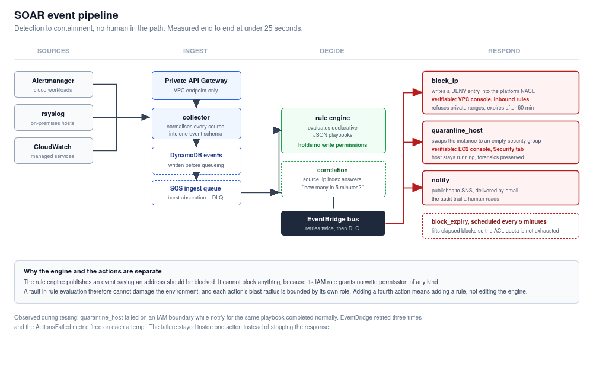

```{=openxml}
<w:p><w:r><w:br w:type="page"/></w:r></w:p>
```

# 1. What this system does

The SOAR system closes the gap between an alert firing and someone acting on it.

Before it existed, a failed-login burst against a corporate server produced a log line, and possibly an email, and then waited for a human. That wait is the window an attacker works in. The system described here reduces that window to roughly twenty seconds, without a human being involved at all.

It does three things in sequence:

1. **Orchestration.** Collects security events from every source into one normalised stream
2. **Automation.** Evaluates each event against declarative playbooks
3. **Response.** Executes containment actions that change the state of the environment

This document explains the logic, documents each playbook, and shows how to add new ones. The architecture and its justification are in the design document; this one is operational.

# 2. Event flow



Measured latency from event submission to network state change during testing: **under 25 seconds**, most of which is the five-second SQS batching window plus Lambda cold start.

## 2.1 The normalised event

Every source is translated into one schema. The rule engine never knows where an event came from.

| Field | Purpose |
|---|---|
| `event_id` | UUID, primary key in the event store |
| `received_at` | ISO-8601, sort key and correlation window boundary |
| `source` | `alertmanager`, `syslog`, `cloudwatch`, `direct` |
| `event_type` | What happened, the primary match criterion |
| `severity` | `critical`, `high`, `medium`, `low` |
| `source_ip` | Attacker address where applicable; indexed for correlation |
| `target_host` | Affected host, human-readable |
| `target_instance_id` | EC2 instance ID, required for host-level actions |
| `description` | Human-readable summary, carried into notifications |
| `raw` | Original payload, preserved for forensics |
| `expires_at` | TTL, 30 days |

Two deliberate details. `source_ip` defaults to the string `unknown` rather than being absent, because it is a DynamoDB index key and an empty value would break the correlation query. And an unrecognised syslog line is stored as `syslog_generic` rather than discarded. An event nobody has written a rule for is a gap in coverage, and the `EventsUnmatched` metric makes that gap visible.

## 2.2 Correlation

Threshold rules need to answer "how many times has this happened recently?" A global secondary index on `source_ip` with `received_at` as sort key makes that a bounded query rather than a table scan, so the cost stays flat as the event store grows.

This is what separates a real detection from a trigger. One failed SSH login is noise. People mistype passwords. Five from the same address inside five minutes is an attack. Playbook PB-001 fires on the pattern, not the event.

If the correlation query fails for any reason, the engine returns a count of 1. That is a deliberate fail-closed choice: a database problem must not cause a threshold rule to fire on a single event.

```{=openxml}
<w:p><w:r><w:br w:type="page"/></w:r></w:p>
```

# 3. The Response capability

The three letters of SOAR are not equally hard. Orchestration is plumbing, and automation is a rule engine. Response is the part where software is permitted to change a production environment on its own, and it is the part this project exists to demonstrate.

This section sets out what Response means here, what the system actually does, and how to prove it in front of someone.

## 3.1 What counts as a response

A system has a Response capability when an alert causes the environment to change without a person acting. That is a higher bar than it sounds, and three things that often pass for Response do not meet it:

**Sending an email is not a response.** It moves the problem to a human inbox. The attacker is still connected while somebody reads it.

**Writing to a log or a ticket is not a response.** It records the problem. Nothing about the environment is different afterwards.

**Running an action manually after seeing an alert is not a response.** The automation ends where the decision begins, and the decision is the slow part.

The test applied throughout this project: after the event, is there something an assessor can point at in the AWS console that was not there before, and did any human touch it? Both response actions below satisfy that test, and the evidence is in the test results document.

## 3.2 What the system actually changes

Two actions change infrastructure state. They were chosen to be structurally different from each other, so the capability is not a single trick repeated.

### Network-level containment: block_ip

The action writes a DENY entry into the network access control list guarding the platform spoke.

| | |
|---|---|
| **Before** | The ACL contains rule 100 (allow all) and the implicit default deny at 32767 |
| **After** | Rule 101 appears: DENY, all protocols, source `203.0.113.66/32` |
| **Effect** | The address cannot reach anything in the spoke, including flows already established |
| **Where to see it** | VPC console, Network ACLs, `acl-068c30bcdb9226b04`, Inbound rules |
| **Reversal** | Automatic after 60 minutes, by the scheduled expiry function |

Network ACLs were chosen over security groups precisely because of that third row. Security groups are allow-lists with no deny concept and they are stateful, so an attacker with an established connection keeps it. ACLs are stateless and evaluate DENY first, which means the block applies to traffic already in flight. For containment that difference is the whole point.

### Host-level containment: quarantine_host

The action replaces an instance's security groups with an isolation group that has no rules at all.

| | |
|---|---|
| **Before** | Instance `i-049e95348a865e18d` carries `sg-0eb7e12fcddcdfed3`, reachable on port 9100 |
| **After** | It carries `sg-0b4ece4aff6a3eebe`, which has zero inbound and zero outbound rules |
| **Effect** | Nothing can reach the host and the host can reach nothing, including any command-and-control endpoint |
| **Where to see it** | EC2 console, the instance, Security tab |
| **Reversal** | Manual, using the original groups recorded at quarantine time |

A security group with no rules denies everything, because security groups are default-deny. The empty rule tables are the isolation, not evidence of a misconfiguration.

The instance keeps running. Stopping it would clear memory and destroy volatile evidence; terminating it would destroy everything. Containment should not also be evidence destruction, so the host is cut off and left alive for forensics.

## 3.3 Why the response is trustworthy

A system permitted to change production on its own is only acceptable if it is also constrained. Three properties do that work.

**The component that decides cannot act.** The rule engine's IAM role grants DynamoDB read, SQS consume, and permission to publish an event. It holds no permission to modify any resource in the account. It can say an address should be blocked; it cannot block one. A fault in rule evaluation is therefore incapable of damaging the environment.

**Every destructive action has explicit refusal conditions, and they are tested.** `block_ip` refuses private and loopback ranges outright, because an automated blocker that can be induced to block internal addresses can lock its own operators out of the environment. `quarantine_host` requires an instance to carry `SOARable=true` and refuses anything tagged as the k3s server or the hybrid gateway, so the system cannot isolate the infrastructure it runs on. Test E-04 verifies the refusal path fires, and the `ActionsSkipped` metric makes refusals visible in operation rather than looking like inaction.

**The permissions are narrow enough to be interesting.** The quarantine action may attach one specific security group and no other. The consequence is that this role can move a host into isolation and has no way to move it out. Releasing a host is therefore necessarily a human decision, which is correct: deciding a compromised machine is safe to return to the network depends on an investigation, not a timer.

That last constraint was not in the original design. It emerged from fixing a permissions failure during testing, and the narrow fix turned out to be better than the broad one would have been. The full account is in the test results document under R-01.

## 3.4 Demonstrating it

Run `scripts/test-soar-bruteforce.ps1`. It prints the ACL state, submits five failed-authentication events from one address, waits, and prints the ACL state again. The verdict line at the end states pass or fail against the presence of a DENY rule that was not there before.

A live demonstration works better with the console open alongside the terminal:

1. Open the VPC console on the platform network ACL, Inbound rules. Two rules are present.
2. Run the brute-force script. Narrate the five events going in and the threshold at five in five minutes.
3. Refresh the console. Rule 101 has appeared, denying the test address.
4. Open the EC2 console on the demo workstation, Security tab. Note the normal security group.
5. Run the quarantine script.
6. Refresh. The security group is now the quarantine group, with empty rule tables, and the instance is still running.

The point to make while refreshing is that nothing was clicked in the console. The only thing typed was an event arriving, and everything after that was the system deciding and acting.

If a network problem prevents the live run, the recorded evidence in the test results document covers the same ground, and the CloudWatch log groups hold the timestamped record of each stage.

## 3.5 What the response does not do

Stated plainly, because the limits are part of the design.

| Not done | Why |
|---|---|
| No host is stopped or terminated | Destroys evidence. Isolation achieves containment without it. |
| No user account is disabled | Would need identity provider integration, out of scope for this period. |
| No traffic is redirected to a honeypot | Interesting, but adds infrastructure without demonstrating anything new. |
| Availability alerts trigger no containment | PB-004 is notify-only on purpose. Isolating a merely unhealthy host converts a partial outage into a total one. |
| Nothing is released from containment automatically except IP blocks | Time-boxed network blocks are low risk to reverse. Returning a possibly-compromised host is not. |

Knowing when the system should decline to act is as much a part of the response design as knowing when it should act, and PB-004 exists to make that decision explicit rather than accidental.

# 4. The rule engine

## 4.1 Evaluation

For each event, every enabled playbook is checked in order. Matching is layered so that cheap checks run before expensive ones:

1. **`event_type`.** must be in the playbook's list
2. **`severity`.** must be in the playbook's list
3. **Conditions.** `source_ip_is_external`, `requires_target_instance`
4. **Threshold.** The correlation query, only reached if everything above passed

An event may match several playbooks; all of their actions are dispatched. Every non-match is logged with its reason, so a playbook that unexpectedly fails to fire during a demonstration can be explained in seconds rather than debugged.

## 4.2 The separation that matters

**The rule engine holds no permission to modify anything.** Its IAM role grants DynamoDB read, SQS consume, and `events:PutEvents`. That is all.

It can publish an event saying an address should be blocked. It cannot block an address. The action functions hold those permissions, each scoped to its own single job.

The consequence is that a bug in rule evaluation. a mis-parsed threshold, an inverted condition, a malformed playbook. Cannot damage the environment. It can only cause the wrong event to be published, which is then subject to each action's own safety checks.

# 5. Response actions

## 5.1 block_ip

**What it does.** Writes a DENY entry into the platform spoke's network ACL for the offending address.

**Why a network ACL rather than a security group.** Security groups have no concept of deny, they are allow-lists, so blocking one address means enumerating everything else. Network ACLs are stateless and evaluate DENY before ALLOW, so a block takes effect on established flows as well as new ones. For containment, stopping traffic already in progress is the point.

**Rule numbering.** Entries are allocated from 100–400. Below 100 is reserved for static, operator-authored baseline rules, so machine-authored policy is visually separated from human policy in the console.

**Safety guards.**

| Guard | Behaviour |
|---|---|
| RFC1918 and loopback ranges | Refused. An automated system that can lock out its own operators is more dangerous than the attack it is responding to. |
| Unparseable address | Refused, treated as protected. |
| Address already blocked | Skipped and reported as `already_blocked`, so repeated events are idempotent. |
| No free rule numbers | Raises rather than overwriting an existing rule. |

**Expiry.** Every block records an expiry timestamp. A scheduled function runs every five minutes, removes elapsed entries from the ACL, and marks the record `expired`. Without this, blocks would be permanent and the ACL's default twenty-rule quota would be exhausted. After which no further blocks would be possible at all. The cleanup is not housekeeping; it is what keeps the action working.

**Verification.** VPC console → Network ACLs → Inbound rules. A numbered DENY entry appears within seconds.

## 5.2 quarantine_host

**What it does.** Replaces an instance's security groups with an isolation group that has no ingress rules and no egress rules.

**Why isolation rather than shutdown.** A security group with no rules denies everything. The instance is unreachable and cannot call out to a command-and-control endpoint. But it stays *running*, so memory forensics remain possible and the disk is untouched. Stopping the instance would destroy volatile evidence; terminating it would destroy everything. Containment should not also be evidence destruction.

**Safety guards.**

| Guard | Behaviour |
|---|---|
| `SOARable=true` tag required | Instances not explicitly marked as quarantinable are refused. |
| `Role=k3s-server` or `Role=hybrid-gateway` | Hard refusal. The system must not be able to isolate its own infrastructure. |
| No `target_instance_id` on the event | Skipped, the action cannot guess a target. |
| Already quarantined | Skipped, idempotent. |
| IAM condition on `aws:ResourceTag/SOARable` | Enforced independently of the code. If the handler's check were bypassed, the API call still fails. |

**Restoration is deliberately manual.** The original security groups are recorded at quarantine time so restoration is exact rather than guessed. But the action's IAM policy permits attaching *only* the quarantine group, which means this role can move a host into isolation and cannot move it out. Deciding that a compromised host is safe to return to the network is a judgement about an investigation, not something to automate on a timer. `scripts/restore-quarantined-host.ps1` performs the release.

**Verification.** EC2 console → instance → Security tab. The security group changes to `innovatech-quarantine` with empty inbound and outbound tables.

## 5.3 notify

**What it does.** Publishes a formatted message to SNS, delivered by email.

**Why it is in every playbook.** It is the only action with no capacity to break anything, so it can safely accompany any response. It is also the audit trail a human reads: the message states what was detected, where, and what the system already did about it.

The body is written for someone reading it on a phone at three in the morning. Playbook, event ID, severity, source, target, description, and a pointer to the Grafana dashboard. No stack traces, no JSON.

# 6. Playbook catalogue

Playbooks live in `soar/playbooks/playbooks.json`. They are data, not code: the file is packaged with the rule engine so the deployed artefact and the rules it enforces are versioned together and cannot drift apart.

## PB-001. External SSH brute force

| | |
|---|---|
| **Triggers on** | `ssh_auth_failure`, `SSHBruteForce` |
| **Severity** | high, critical |
| **Conditions** | Source address external; 5 occurrences from the same address within 5 minutes |
| **Actions** | `block_ip` (60 min), `notify` (high) |
| **Rationale** | The correlation threshold is what makes this a detection rather than a tripwire. A single failure is a typo; five in five minutes is an attempt. |

## PB-002. Host compromise indicator

| | |
|---|---|
| **Triggers on** | `privilege_escalation_attempt`, `malware_detected`, `HostCompromiseIndicator` |
| **Severity** | high, critical |
| **Conditions** | Event must name a target instance |
| **Actions** | `quarantine_host`, `notify` (critical) |
| **Rationale** | Containment is ordered before notification on purpose. When an attacker may be active on a host, minutes matter more than the operator's inbox. |

## PB-003. Unauthorised port scan

| | |
|---|---|
| **Triggers on** | `port_scan_detected`, `PortScanDetected` |
| **Severity** | medium, high, critical |
| **Conditions** | Source address external |
| **Actions** | `block_ip` (30 min), `notify` (medium) |
| **Rationale** | Shorter block than a brute force. Scans are noisier and more often incidental, so the response is proportionate. |

## PB-004. Service unavailable

| | |
|---|---|
| **Triggers on** | `ServiceDown`, `TargetDown`, `cloudwatch_alarm` |
| **Severity** | high, critical |
| **Actions** | `notify` only |
| **Rationale** | **Deliberately notify-only.** This is an availability alert, not a security event. Automatically isolating a host that is merely unhealthy would convert a partial outage into a total one. Knowing when *not* to act is as much a design decision as knowing when to. |

## PB-005. Database connection saturation

| | |
|---|---|
| **Triggers on** | `DatabaseConnectionsHigh`, `RDSConnectionsHigh` |
| **Severity** | medium, high, critical |
| **Actions** | `notify` (medium) |
| **Rationale** | Early warning. Any automated remediation here, killing connections, restarting a service, risks data loss. |

# 7. Adding a playbook

Editing `playbooks.json` is enough if the response uses an existing action.

```json
{
 "id": "PB-006",
 "name": "Repeated web application firewall blocks",
 "enabled": true,
 "description": "Sustained probing against the public application.",
 "match": {
 "event_type": ["waf_block"],
 "severity": ["medium", "high"]
 },
 "conditions": {
 "source_ip_is_external": true,
 "threshold": { "count": 20, "window_minutes": 10, "group_by": "source_ip" }
 },
 "actions": [
 { "type": "block_ip", "params": { "duration_minutes": 120 } },
 { "type": "notify", "params": { "subject": "[SOAR] WAF probing blocked", "priority": "medium" } }
 ]
}
```

Commit, push, and the pipeline redeploys the rule engine with the new file. No engine code changes.

**Test it with `enabled: false` first.** A disabled playbook is still evaluated and logged, so you can confirm it matches the events you expect before it is allowed to act.

# 8. Adding an action

An action is a new function plus a new EventBridge rule. Four steps:

1. **Write the handler** in `soar/actions/<name>/handler.py`. Read `event["detail"]["event"]` and `event["detail"]["action_params"]`. Emit `ActionsExecuted`, `ActionsFailed` or `ActionsSkipped` metrics.
2. **Add the IAM role and policy** in `terraform/42-soar-iam.tf`, scoped to the minimum the action needs.
3. **Add the function and its archive** in `terraform/43-soar-lambdas.tf`.
4. **Add it to `local.soar_action_targets`** in `terraform/44-soar-eventbridge.tf`. The rule, target, permission and dead-letter configuration are generated from that map.

The rule engine is not touched at any point. That is the property the EventBridge indirection buys.

**Before writing a destructive action, decide its refusal conditions first.** Both existing destructive actions have explicit guards, and both were designed guard-first. What an automated action must *never* do is a harder and more important question than what it should do.

# 9. Operating the system

## 9.1 Health indicators

| Signal | Healthy | Investigate when |
|---|---|---|
| `EventsIngested` | Tracks alert volume | Zero while alerts are firing, check the Alertmanager webhook |
| `EventsUnmatched` | Low and stable | Rising, real events have no playbook |
| `ActionsExecuted` vs `ActionsDispatched` | Equal | Divergent, actions are failing |
| `ActionsFailed` | Zero | Any value, check the action's log group |
| `ActionsSkipped` | Occasional | Frequent with one reason, a guard is firing more than expected |
| Ingest DLQ depth | Zero | Above zero, events failing evaluation repeatedly |
| Action DLQ depth | Zero | Above zero, dispatches undeliverable after retries |

## 9.2 Reading the dashboard honestly

The panels are designed so that non-zero failure and refusal counts are informative rather than embarrassing, and they should be read that way.

**Actions failed above zero** means a response could not be executed. During this project it meant an IAM permission had been reverted by a file overwrite, and the dashboard is where that became visible. The correct reaction is to open the action's log group, not to assume the number is noise.

**Actions refused above zero** is usually the system working. The reason label says which guard fired. `protected_range` means an internal address was correctly not blocked. `not_soarable` means an instance was correctly not isolated. `already_blocked` means a repeated event was correctly ignored. These are the safety guards leaving a trace, and their absence over a long period is more suspicious than their presence.

**Unmatched events rising** is a coverage gap rather than a fault. It means real events are arriving that no playbook handles. The event type label says which, and that is the best available guide to what should be automated next.

A dashboard showing nothing but zeros across every panel usually means the system is idle, but it can also mean the metrics pipeline is broken. The two look identical. Run a test and watch the numbers move before concluding the system is healthy.

## 9.3 Common situations

**An alert fired but nothing happened.** Check the rule engine log. Every non-match is logged with a reason. Usually `severity mismatch` or `below threshold`.

**An action was skipped.** Check the action's log for the guard that refused. `protected_range` and `not_soarable` are the two most common, and both are the system working correctly.

**Events are reaching DynamoDB but not being processed.** Check the SQS event source mapping is enabled and the ingest DLQ for parked messages.

**The block list is full.** The scheduled expiry function has failed or is disabled. Check its log group, then run `scripts/clear-soar-blocks.ps1` to reset.

## 9.4 Emergency stop

If the system is responding incorrectly and needs to stop immediately, disable the queue trigger. Events continue to be collected and stored, but nothing is evaluated or acted on:

```
aws lambda update-event-source-mapping --uuid <mapping-uuid> --no-enabled
```

This is preferable to deleting resources: it is instant, reversible with `--enabled`, and preserves the event stream so nothing is lost while the problem is investigated.
